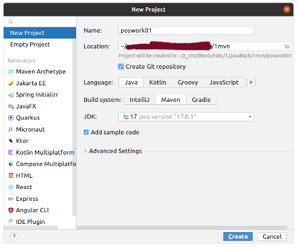

# Construcción de proyectos con Maven.

Para crear un proyecto Maven con IntelliJ se va a File->New->Project y se establece la configuración de la imagen. Para que además se pueda subir a un repositorio se selecciona "Create Git repository".

Para poder generar el .jar se agrega lo siguiente al pom.xml

~~~
    <build>
        <plugins>
            <plugin>
                <groupId>org.apache.maven.plugins</groupId>
                <artifactId>maven-jar-plugin</artifactId>
                <version>3.1.0</version>
                <configuration>
                    <archive>
                        <manifest>
                            <mainClass>org.example.Main</mainClass>
                        </manifest>
                    </archive>
                </configuration>
            </plugin>
        </plugins>
    </build>
~~~

Para crear el jar con Maven y ejecutarlo:

~~~
mvn clean
mvn package
java -jar ./target/poswork01-1.0-SNAPSHOT.jar
~~~

El proyecto también se puede ejecutar mediante el IDE con el icono "RUN" o con "Mayúsculas+F10" en IntelliJ.

Para subir el proyecto a un repositorio nuevo, previamente creado:

~~~
git remote add origin git@github.com:matahj/SetUp_Project_Maven_IntelliJ.git
git branch -M main
git push -u origin main
~~~

Para clonar el proyecto:
~~~
git clone https://github.com/matahj/SetUp_Project_Maven_IntelliJ.git
~~~

Después se abre con IntelliJ, se ejecuta o se obtiene el jar como se indicó previamente.

Repositorio del proyecto de ejemplo:

[https://github.com/matahj/SetUp_Project_Maven_IntelliJ](https://github.com/matahj/SetUp_Project_Maven_IntelliJ)
