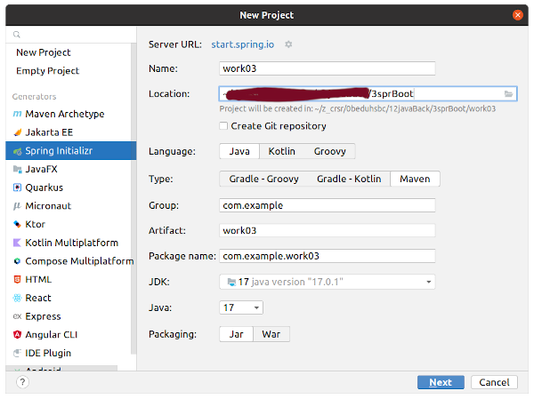
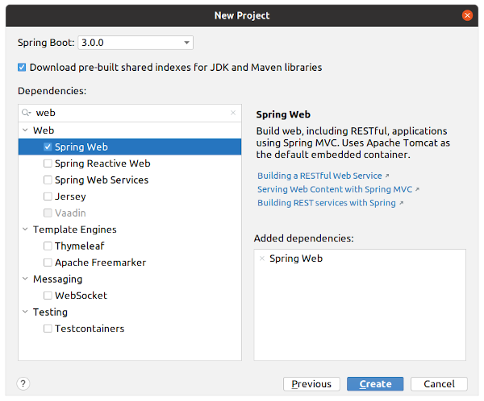
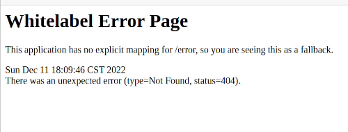

# Introducción a Spring Boot.

Para crear un proyecto se puede utilizar el sitio "[spring initializr](https://start.spring.io/)" o directamente desde IntelliJ en File->NewProject, en cualquier caso se puede seleccionar una configuración inicial y diversas dependencias. 

En este work se selecciona la dependencia Spring Web que nos permite hacer una aplicación web RESTful basada en Spring MVC sobre Apache Tomcat.

Para ejecutar el proyecto desde la terminal:
~~~
mvn clean
mvn spring-boot:run
~~~

Enseguida, para comprobar que se está ejecutando, se abre la siguiente dirección en un navegador:

~~~
localhost:8080
~~~

En este work se implementa un api (un controlador sin acceso a base de datos) con los siguientes endpoints:

~~~
http://localhost:8080/prueba/hello
http://localhost:8080/prueba/goodbye
http://localhost:8080/prueba/curso

http://localhost:8080/obtenerCursos
http://localhost:8080/obtenerCurso/1002

localhost:8080/crearCurso
~~~

Anotaciones utilizadas:
~~~
@RestController
@RequestMapping("/prueba")
@GetMapping("/hello")
@GetMapping("/goodbye")
@GetMapping("/curso")
@GetMapping("/obtenerCursos")
@GetMapping("/obtenerCurso/{id}")
@PathVariable long id
@PostMapping("/crearCurso")
@RequestBody CrearCurso data
~~~

