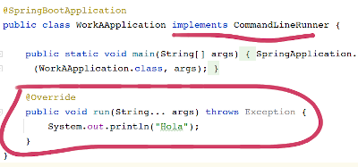
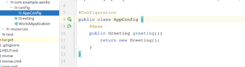
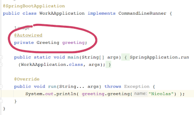
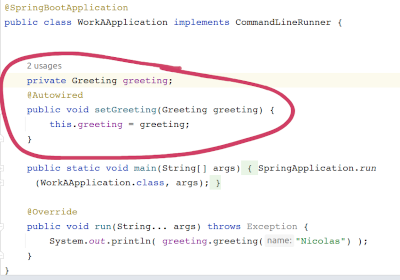
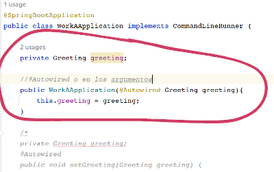
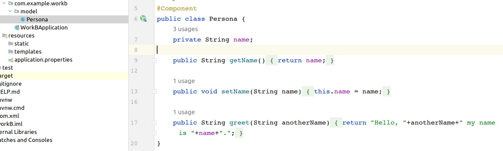
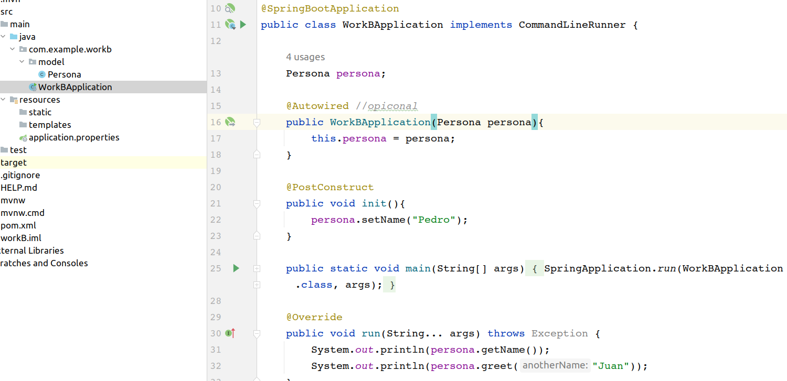

# Java Beans, Inversión de Control, Inyección de dependencias

La Inversión de Control se encarga de entregar las instancias de los componentes y sus dependencias (inyección de dependencias) cuando se soliciten. Los componentes pueden ser (i)Beans (configurados en clases @Configuration, inicialización manual) (ii)Componentes (Clases @Component, inicializados automáticamente por Spring).  

### WorkA
Teniendo un proyecto Spring Web, se pude imprimir en la terminal haciendo que la clase principal implemente "CommandLineRuner" y el método run, la salida de ese método se va a la terminal.

(i) Los Beans se configuran en una clase @Configuration.

Tres maneras para inyectar dependencias:

1. @Autowired en el atributo. Temas de seguridad y performance.

2. @Autowired en el método set. Exceso de código.

3.- @Autowired en el constructor. ES LA MEJOR FORMA.

Anotaciones utilizadas
~~~
@Configuration  //Clase que crea las instancias
@Bean           //Método que crea una instancia a partir del Bean

@Autowired      //objeto que recibe la instancia
~~~

### WorkB

(ii)La clase se configura como componente, se inyecta en el constructor y se utiliza @PostConstruct.

Anotaciones utilizadas
~~~
@Component      //Spring genera la instancia
@Autowired      //opiconal
@PostConstruct  //Inicialización
~~~

### Work C

Se hace un bckend con:

1. Controller. Atiende las peticiones http. Aquí se inyectan las dependencias.
~~~
@RestController
@RequestMapping("/posts")
@GetMapping()
~~~
2. Servicio. Lógica de negocio. Se utiliza una Interface, para dar la libertad de cambiar la implementación. En la implementación:
~~~
@Service
@Override  //se implementa la interface
~~~

3. Repository. Gestión de datos. Aún no se accede a bases de datos.

